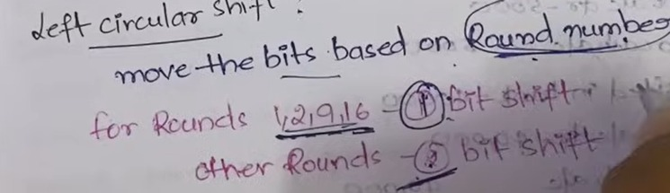

# Cyber Security Concepts

## 1. **Complete Malware analysis lifecycle along with tools and reasons to use them.**

## 2. **SSL/TLS**
HTTPS is the secure version of HTTP, using SSL (Secure Sockets Layer) or its successor TLS (Transport Layer Security) to encrypt data between the browser and server, preventing eavesdropping, tampering, or forgery.

- `SSL`: Developed in the 1990s by Netscape, it's the older protocol (versions 1–3). It's deprecated due to vulnerabilities (e.g., POODLE attack) and hasn't been updated since 1996. Modern browsers reject it.
- `TLS`: The evolved, standardized version (RFC by IETF) since 1999. Current versions are TLS 1.2 (widely used) and TLS 1.3 (faster, more secure, default in most browsers since 2020). TLS provides confidentiality, integrity, and authentication.

### How HTTPS/TLS Works (Simplified Handshake and Data Flow):

1. `Client Hello`: Browser sends a "Hello" message to the server with supported TLS versions, cipher suites (encryption algorithms), and a random number for key generation.
2. `Server Hello`: Server responds with chosen TLS version, cipher suite, its random number, and its digital certificate (containing public key, issued by a Certificate Authority like Let's Encrypt).
3. `Certificate Verification`: Browser verifies the certificate's validity (not expired, trusted CA, matches domain) using pre-installed CA roots.
4. `Key Exchange`:
- **In TLS 1.3 (forward secrecy preferred)**: Browser generates a pre-master secret, encrypts it with the server's public key, and sends it.
Both sides derive a symmetric session key (for faster encryption) from the pre-master secret and random numbers.

- **Finished Messages**: Both exchange encrypted "Finished" messages to confirm the handshake. If valid, the secure channel is established.
- **Secure Data Exchange**: All subsequent HTTP traffic (requests/responses) is encrypted with the session key, ensuring:

- **Confidentiality**: Data is unreadable to interceptors.
- **Integrity**: Tampering is detected via message authentication codes (MACs).
- **Authentication**: Server identity is proven via the certificate.

TLS 1.3 simplifies this to one round-trip, reducing latency. HTTPS ensures secure browsing (e.g., for logins, payments) and is indicated by the padlock icon.

## 3. **DES/AES encryption**
- **Encryption**: Converting plaintext (readable data) into ciphertext (scrambled data) using an algorithm and a key, making it unreadable without the key.
- **Decryption**: Reversing encryption to recover plaintext from ciphertext using the same or a related key.

Cryptography uses two main types: `symmetric (same key for encrypt/decrypt)` and `asymmetric (different keys).`

- **Public-Private Key Encryption (Asymmetric Cryptography)**
    - This uses a pair of keys: a public key (shared openly) for encryption and a private key (secret) for decryption. 
    - Introduced by Diffie-Hellman and RSA in the 1970s, it's ideal for secure key exchange without prior sharing.

How It Works:

- Generate key pair: Public key from private key via math (e.g., RSA uses large primes; factoring is hard).
- Sender encrypts message with recipient's public key → only recipient's private key decrypts it.
- For signatures: Sender signs with private key; anyone verifies with public key (proves authenticity).

Use Cases: SSL/TLS handshakes, digital signatures, PGP email. Slower than symmetric, so often used to exchange symmetric keys.

### AES (Advanced Encryption Standard)

- Type: `Symmetric block cipher` `(fixed 128-bit blocks)`.
- Key Sizes: `128, 192, or 256 bits` (AES-256 most secure).
- How It Works: Adopted by NIST in 2001 (successor to DES). Uses rounds of substitution, permutation, and XOR operations with the key to scramble data. Decryption reverses these rounds.
- Strengths: Fast, secure against brute-force (e.g., AES-256 needs ~10^77 operations to crack). Used in HTTPS, Wi-Fi (WPA2/3), disk encryption (BitLocker).
- Modes: Like CBC (chaining blocks) or GCM (authenticated encryption) for real-world use.

### DES (Data Encryption Standard)

- Type: `Symmetric block cipher` `(64-bit blocks)`.
- Key Size: `56 bits (effective)`.
- How It Works: Developed in 1977 by IBM for US government. Uses 16 rounds of Feistel structure (split data, encrypt half with key, recombine). Decryption uses same key/rounds in reverse order.
- Weaknesses: Outdated; 56-bit key is crackable in hours with modern hardware (e.g., via rainbow tables). Triple DES (3DES) chains three DES for more security but is slow/deprecated.
- Legacy Use: Old banking systems; phased out for AES.

## 4. **Types of malwares**
- `Viruses`: Self-replicating programs that attach to legitimate files and spread by infecting other programs, often causing system failures or data theft.
- `Worms`: Standalone malware that spreads across networks by exploiting vulnerabilities, consuming bandwidth without needing a host file.
- `Trojan Horses`: Deceptive programs that masquerade as legitimate software to trick users into installation, often creating backdoors for further attacks.
- `Backdoors`: Hidden access points that allow unauthorized remote control of a system, bypassing normal security measures.
- `Ransomware`: Encrypts files or locks systems, demanding payment for decryption, frequently delivered via email attachments.
- `Spyware`: Secretly monitors user activity to steal sensitive information like passwords or credit card details.
- `Adware`: Displays unwanted advertisements, often bundled with free software, which can slow down devices and redirect browsers.
- `Rootkits`: Conceal other malware by altering system files, making detection difficult and enabling persistent access.

## 5. **Types of Cyber Attacks**
- `DoS and DDoS Attacks`: Overwhelm a target with traffic to disrupt service availability, using single or multiple sources to flood resources.
- `MITM Attacks`: Intercept communication between two parties to eavesdrop or alter data in transit without detection.
- `Phishing Attacks`: Use deceptive emails or messages from trusted sources to lure victims into revealing sensitive information or downloading malware.
- `Spear-Phishing Attacks`: Targeted phishing customized for specific individuals, leveraging personal details for higher success rates.
- `Ransomware Attacks`: Encrypt victim data and demand ransom for access, often propagating through networks.
- `Password Attacks`: Attempt to crack credentials via brute force, dictionary methods, or social engineering to gain unauthorized access.
- `SQL Injection Attacks`: Insert malicious code into database queries to manipulate, extract, or delete data.
- `XSS Attacks`: Inject harmful scripts into web pages viewed by others, executing code in the victim's browser to steal data or perform actions.

## 6. **Types of Software Testing**

Automation Tools:
1. **Unit Testing**: JUnit (Java), pytest (Python), Mocha/Jest (JavaScript).
2. **API Testing**: Postman, RestAssured, SoapUI.
3. **UI Testing**: Selenium, Cypress, Playwright.
4. **Performance Testing**: JMeter, Gatling, Locust.

## 7. **What happens when we type a url in the browser?**
When you type a URL (e.g., https://www.example.com) into your browser's address bar and hit Enter, a series of steps occur behind the scenes to load the webpage. Here's a step-by-step breakdown:

1. `URL Parsing`: The browser parses the URL to extract components like the protocol (e.g., HTTPS), domain (e.g., www.example.com), path (e.g., /page), and any parameters.
2. `DNS Resolution`: The browser checks its cache for the domain's IP address. If not found, it queries a DNS resolver (often your ISP's or a public one like Google's 8.8.8.8). The resolver performs recursive lookups across DNS servers (root, TLD, authoritative) to get the IPv4/IPv6 address of the server.
3. `Establishing a Connection`: Using the IP address, the browser initiates a TCP (Transmission Control Protocol) handshake:

- SYN: Browser sends a SYN packet to the server.
- SYN-ACK: Server responds with SYN-ACK.
- ACK: Browser sends ACK, establishing a reliable connection on port 80 (HTTP) or 443 (HTTPS).

4. `TLS/SSL Handshake (if HTTPS)`: For secure sites, the browser and server negotiate encryption keys via a TLS handshake (more on this in question 2).

5. `Sending the HTTP Request`: The browser sends an HTTP/HTTPS request to the server, including:

- Method (e.g., GET).
- Headers (e.g., User-Agent, cookies, Accept-Language).
- The full URL path.

6. `Server Processing`: The server receives the request, processes it (e.g., queries a database, runs scripts), and generates a response, including:

- Status code (e.g., 200 OK).
- Headers (e.g., Content-Type: text/html).
- Body (HTML, CSS, JS, images).

7. `Response Handling`: The browser receives the response, parses the HTML, and starts rendering the page. It fetches additional resources (CSS, JS, images) in parallel via more requests, building the DOM (Document Object Model) and applying styles/scripts.

8. `Rendering and Interaction`: The browser renders the page visually, executes JavaScript, and handles user interactions. Caching may store resources for faster future loads.

This process typically takes milliseconds but can vary based on network speed, server load, and redirects.