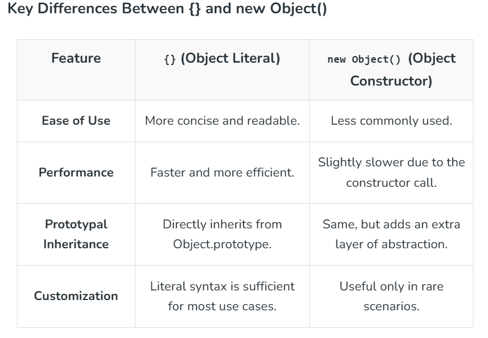
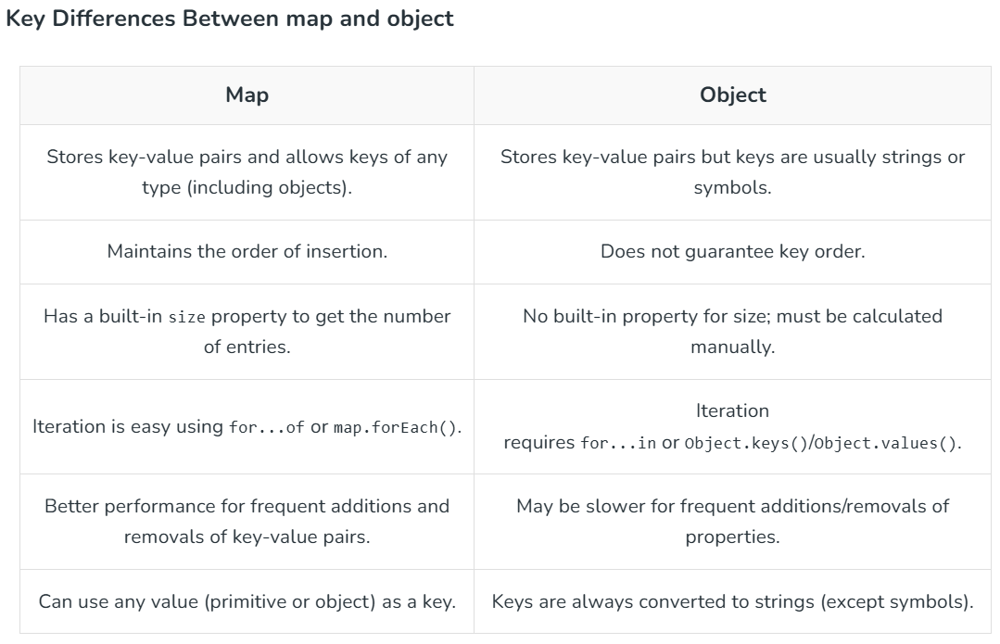

# **Basic OOPS in JavaScript**
Object Oriented Programming (OOP) is a style of programming that uses classes and objects to model real-world things like data and behavior.

# **Indexing**
| sl. no. | Topics |
|---------|--------|
| 1. | [Classes](#1-classes)|
| 2. | [Objects](#2-objects)|
| 3. | [Abstraction](#3-abstraction)|
| 4. | [Encapsulation](#4-encapsulation)|
| 5. | [Inheritence](#5-inheritance)|
| 6. | [Polymorphism](#6-polymorphism)|


## **1. Classes**
- A class is a blueprint for creating objects with specific properties and methods. 
- A class itself doesn’t hold values, it describes what an object should have and do. 
```js
// Class definition
class Car {
  constructor(brand, model) {
    this.brand = brand; // property
    this.model = model; // property
  }

  // method
  showDetails() {
    console.log(`This car is a ${this.brand} ${this.model}.`);
  }
}

// Creating objects from the class
const car1 = new Car("Toyota", "Corolla");
const car2 = new Car("Honda", "Civic");

// Using the objects
car1.showDetails(); // This car is a Toyota Corolla.
car2.showDetails(); // This car is a Honda Civic.
```

## **2. Objects**
An object is a `dynamic data structure` that stores related data as key-value pairs, where each key uniquely identifies its value. Properties can be added, changed, or removed at any time.

- There are `two primary ways to create an object` in JavaScript:

1. Creation Using Object Literal {}
```js
let obj = {
    name: "Sourav",
    age: 23,
    job: "Developer"
};
console.log(obj);

// Output
// { name: 'Sourav', age: 23, job: 'Developer' }
```

2. Creation Using new Object() Constructor
```js
let obj = new Object();
obj.name= "Sourav",
obj.age= 23,
obj.job= "Developer"
​
console.log(obj);

Output
{ name: 'Sourav', age: 23, job: 'Developer' }
```

### Basic Operations on JavaScript Objects
1. Accessing Object Properties: 
```js
let obj = { name: "Sourav", age: 23 };
​
// Using Dot Notation
console.log(obj.name);
​
// Using Bracket Notation
console.log(obj["age"]);

// Output
// Sourav
// 23
```

2. Modifying Object Properties
```js
let obj = { name: "Sourav", age: 22 };
console.log(obj);
​
obj.age = 23;
console.log(obj);

// Output
// { name: 'Sourav', age: 22 }
// { name: 'Sourav', age: 23 }
```

3. Adding Properties to an Object
You can dynamically add new properties to an object using dot or bracket notation.
```js
let obj = { model: "Tesla" };
obj.color = "Red";
console.log(obj);

// Output
// { model: 'Tesla', color: 'Red' }
```
4. Removing Properties from an Object
```js
let obj = { model: "Tesla", color: "Red" };
delete obj.color;
​
console.log(obj);

// Output
// { model: 'Tesla' }
```

5. Checking if a Property Exists
- You can check if an object has a property using the in operator or hasOwnProperty() method.
```js
let obj = { model: "Tesla" };
console.log("color" in obj);
console.log(obj.hasOwnProperty("model"));

// Output
// false
// true
```

6. Iterating Through Object Properties
```js
let obj = { name: "Sourav", age: 23 };
for (let key in obj) {
    console.log(key + ": " + obj[key]);
}

// Output
// name: Sourav
// age: 23
```

7. Merging Objects
Objects can be merged using Object.assign() or the spread syntax { ...obj1, ...obj2 }.
```js
let obj1 = { name: "Sourav" };
let obj2 = { age: 23};
​
let obj3 = { ...obj1, ...obj2 };
console.log(obj3);

// Output
// { name: 'Sourav', age: 23 }
```

8. Object Length
You can find the number of properties in an object using Object.keys().
```js
let obj = { name: "Sourav", age: 23 };
console.log(Object.keys(obj).length);

// Output
// 2
```

9. Recognizing a JavaScript Object
To check if a value is an object, use typeof and verify it's not null.
```js
let obj = { name: "Sourav" };
console.log(typeof obj === "object" && obj !== null);

// Output
// true
```

### Common Mistakes with JavaScript Objects
In JavaScript, there are two main ways to create objects

- `Using Object Literal Syntax ({})`: This is the most common and simple way to create objects.
- `Using the Object Constructor (new Object())`: This uses JavaScript's built-in Object constructor to create objects.

At first glance, both approaches seem to achieve the same result. However, there are `significant differences` to understand.





## **3. Abstraction**
Abstraction can be defined as the concept of hiding the inner complex workings of an object and exposing only the essential features to the user.

```js
class MyClass{
    constructor(name, age) {
        this.name = name;
        this.age = age;
    }
    func() {
        return `${this.name} is ${this.age} years old.`;
    }
}
const obj1 = new MyClass("Anuj", 30);
console.log(obj1.func());

// output
// Anuj is 30 years old.
```

### Implementing Abstraction in JavaScript
The JavaScript `does not provide built-in support for implementing the abstraction` like the other programming language gives. However we can `implement abstraction` in JavaScript using `functions`, `objects`, `closures`, and `classes`.

1. Using Functions
```js
function a(radius) {
    return Math.PI * radius * radius;
}
console.log(a(5));

// Output
// 78.53981633974483
```

2. Using Objects and Methods
```js
const car = {
    brand: "Toyota",
    start: function() {
        console.log("Car started");
    }
};
​
car.start();

// Output
// Car started
```

3. Using Closures
- Closures help in abstraction by restricting access to certain variables, making them private.
```js
function Count() {
    let c1 = 0;
    return {
        inc: function() {
            c1++;
            console.log(c1);
        }
    };
}
​
const c2 = Count();
c2.inc(); 
c2.inc();

// Output
// 1
// 2
```
4. Using Classes and Encapsulation
- ES6 classes help implement abstraction by using constructor functions and private fields (using closures or symbols).

```js
class Bank{
    #balance; //  this is a private field
    constructor(Bank1) {
        this.#balance = Bank1;
    }

    deposit(amount) {
        this.#balance += amount;
        console.log(`Deposited: $${amount}`);
    }

    getBank() {
        return this.#balance;
    }
}
​
const a1 = new Bank(1000);
a1.deposit(500);
console.log(a1.getBank());

// Output
// Deposited: $500
// 1500
```

## **4. Encapsulation**
Encapsulation is hiding the internal details of an object and exposing only the necessary information to the outside world.

Encapsulation can be achieved using two techniques:

1. Using Closures
- In JavaScript, closures are **functions** that `have access to variables in their outer lexical environment`, **even after the outer function has returned**. 
- `Private variables and methods` can be created using closures.

```js
function BankAccount(accountNumber, accountHolderName, balance) {
    // private variables: _variable
    let _accountNumber = accountNumber;
    let _accountHolderName = accountHolderName;
    let _balance = balance;
​
    function showAccountDetails() {
        console.log(`Account Number: ${_accountNumber}`);
        console.log(`Account Holder Name: ${_accountHolderName}`);
        console.log(`Balance: ${_balance}`);
    }
​
    function deposit(amount) {
        _balance += amount;
        showAccountDetails();
    }
​
    function withdraw(amount) {
        if (_balance >= amount) {
            _balance -= amount;
            showAccountDetails();
        } else {
            console.log("Insufficient Balance");
        }
    }
​
    return {
        deposit: deposit,
        withdraw: withdraw
    };
}
​
let myBankAccount = BankAccount("123456", "John Doe", 1000);
myBankAccount.deposit(500); 
myBankAccount.withdraw(2000); 

// Output
// Account Number: 123456
// Account Holder Name: John Doe
// Balance: 1500
// Insufficient Balance
```

2. Using Classes
- Classes can be used to achieve encapsulation in JavaScript


## **5. Inheritance**
Inheritance allows one class or object to derive properties and behaviours from another.

**Common Types of Inheritance**

1. prototype-based inheritance
- In JavaScript, **everything (functions, arrays, strings) is an object**. 
- The prototype stores shared properties and methods, allowing all instances of a type to access them.
```js
function Animal(name) {
    this.name = name;
}
Animal.prototype.speak = function () {
    console.log(`${this.name} makes a sound.`);
};
​
// Child constructor function
function Dog(name) {
    Animal.call(this, name); // Inherit properties
}
​
// Inherit methods from Animal
Dog.prototype = Object.create(Animal.prototype);
Dog.prototype.constructor = Dog;
​
// Adding a new method to Dog
Dog.prototype.bark = function () {
    console.log(`${this.name} barks: Woof!`);
};
​
// Creating an instance
const myDog = new Dog("Buddy");
​
myDog.speak(); 
myDog.bark();

// Output
// Buddy makes a sound.
// Buddy barks: Woof!
```

2. ES6 Class-based Inheritance
```js
class one {
    constructor(name) {
        this.name = name
    }
    speaks() {
        return `my name is ${this.name}`
    }
}
class two extends one {
    constructor(name) {
        super(name)
    }
}
const o = new two('Pranjal')
console.log(o.speaks())

// Output
// my name is Pranjal
```

3. Mixins for Inheritance: 
This code demonstrates prototypal inheritance and object merging using Object.assign(), allowing a constructor function (Person) to inherit methods from multiple objects (one and two).
```js
const one = {
    speak() {
        return `${this.name} walks`
    }
}
const two = {
    walks() {
        return `${this.name} walks`
    }
}
function Person(name) {
    this.name = name
}
Object.assign(Person.prototype, one, two)
const person1 = new Person('Pranjal')
console.log(person1.speak())
console.log(person1.walks())

// Output
// Pranjal walks
// Pranjal walks
```

### 4. Inheritance with Object.create()
Object.create() in JavaScript `creates a new object that uses another object as its prototype`, allowing it to inherit all its properties and methods.
```js
let obj = {
    name: 'Pranjal',
    age: 21,
    prints() {
        return `my name is ${this.name}`
    }
}

let obj1 = Object.create(obj)
obj1.name = 'Hello'
console.log(obj1.age)
console.log(obj1.prints())

// Output
// 21
// my name is Hello
```

5. Inheritance with object.setPrototypeOf()
This code demonstrates prototypal inheritance using Object.setPrototypeOf(), which sets one object (two) as the prototype of another (one). This allows one to access properties from two.
```js
const one = {
    speak() {
        return `${this.name} speaks`
    }
}
const two = {
    name: 'Pranjal'
}
Object.setPrototypeOf(one, two)
console.log(one.speak())

// Output
// Pranjal speaks
```

6. Factory functions for inheritance
This code demonstrates factory functions in JavaScript, where a function (createPerson) returns new objects with shared properties and methods.
```js
function createPerson(name) {
    return {
        name: name,
        greet() {
            return `Hello my name is ${this.name}`
        }
    }
}

const one = createPerson('Pranjal')
const two = createPerson('Pranav')
console.log(one.greet())
console.log(two.greet())

// Output
// Hello my name is Pranjal
// Hello my name is Pranav
```

## **6. Polymorphism**
- In Polymorphism, 'poly' means 'many' and 'morphism' means 'transforming one form into another'. 
- Polymorphism means the same function with different signatures is called many times. 
- It allows methods to do different things based on the object it is acting upon.

In JavaScript, polymorphism works in two primary ways:

1. **Method Overriding**: A child class overrides a method of its parent class.
2. **Method Overloading (simulated)**: A function behaves differently based on the number or type of its arguments.

### **1. Method Overriding(Run time polymorphism)**
- Method overriding occurs when a subclass provides its own specific implementation of a method that is already defined in its parent class. 
- When you call this method, JavaScript will use the subclass's implementation instead of the parent's, which is a runtime decision.

```js
class Animal {
    speak() {
        console.log("Animal makes a sound");
    }
}
​
class Dog extends Animal {
    speak() {
        console.log("Dog barks");
    }
}
​
class Cat extends Animal {
    speak() {
        console.log("Cat meows");
    }
}
​
const dog = new Dog();
dog.speak(); 
​
const cat = new Cat();
cat.speak();

// Output
// Dog barks
// Cat meows
```


### **2. Method Overloading (Compile-time Polymorphism)**
- JavaScript `does not natively support method overloading`, where multiple methods with the same name but different arguments exist in the same scope. 
- However, method overloading` can be simulated` `by checking the number or type of arguments passed to a function`, and executing different logic based on them.

```js
class Calculator {
    add(a, b) {
        if (b === undefined) {
            return a + a; 
        }
        return a + b; 
    }
}
​
const calc = new Calculator();
console.log(calc.add(2)); 
console.log(calc.add(2, 3));

// Output
// 4
// 5
```

- Polymorphism with Functions and Objects
It is also possible in JavaScript that we can make functions and objects with polymorphism.
```js
class A {
    area(x, y) {
        console.log(x * y);
    }
}
class B extends A {
    area(a, b) {
        super.area(a, b);
        console.log('Class B')
    }
}
​
let ob = new B();
let output = ob.area(100, 200);
```