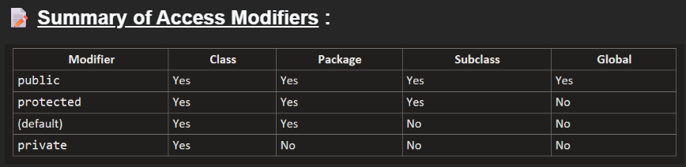
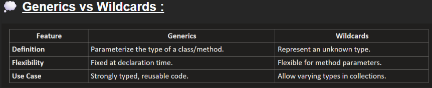

# **Basic Java OOPS**
Object-Oriented Programming (OOP) is a programming paradigm that organizes code into objects, which represent real-world entities. It allows developers to model complex systems by breaking them down into smaller, manageable pieces.

# **Table of Contents**
| sl. no. | topics |
|---------|--------------|
|   1.    | [Classes](#1-classes)      |
|   2.    | [Objects](#2-objects)      |
|   3     | [Constructors](#3-constructors)
|   4.    | [Polymorphism](#4-polymorphism) |
|   5.    | [Inheritance](#5-inheritance)|
|   6.    | [Encapsulation](#6-encapsulation)  |
|   7.    | [Abstraction](#7-abstraction)  |
|   8.    | [Java Keywords](#8-java-keywords)|
|   9.    | [Access Modifiers]()|
|   10.   | [Exception Handling]()|
|   11.   | [Generics and Wildcards](#11-generics)|

# **1. Classes**
- A class is a blueprint for creating objects. 
- It defines the properties (attributes) and behaviors (methods) that the objects will have.

Key Characteristics of a Class:
1. **Attributes** `(State)`: These are `variables` defined within the class that describe the characteristics of the object. 
2. **Methods** `(Behavior)`: These are `functions` defined in the class that describe what the objects can do. 🔧
3. **Constructor**: A special method used to `initialize the attributes` of the class when an object is created. 🛠️

```java
public class Car {
    // Attributes : 
    String manufacturer;
    String model;
    int year;

    // Constructor : 
    public Car(String manufacturer, String model, int year) {
        this.manufacturer = manufacturer;
        this.model = model;
        this.year = year;
    }

    // Methods : 
    public void startEngine() {
        System.out.println("The " + year + " " + manufacturer + " " + model + "'s engine has started.");
    }
    public void displayInfo() {
        System.out.println("Car Info: " + manufacturer + " " + model + " (" + year + ")");
    }
}
```

# **2. Objects**
An object is an instance of a class. It represents a specific realization of the class blueprint, with its own unique set of data.

Key Characteristics of an Object:
1. **State**: Represented by the object’s `attributes`.
2. **Behavior**: Defined by the `methods` the object can execute.
3. **Identity**: A `unique reference` to the object in memory.

```java
public class Main {
    public static void main(String[] args) {

        // Creating objects
        Car car1 = new Car("Toyota", "Corolla", 2021);
        Car car2 = new Car("Honda", "Civic", 2022);

        // Using objects
        car1.startEngine();  // Output: The 2021 Toyota Corolla's engine has started.ĺ
        car2.startEngine();  // Output: The 2022 Honda Civic's engine has started.
        car1.displayInfo();  // Output: Car Info: Toyota Corolla (2021)
        car2.displayInfo();  // Output: Car Info: Honda Civic (2022)
    }
}
```

## **Class Relationships**
**1. Inheritance**:
- Inheritance represents an **`is-a`** relationship where a subclass inherits properties and behaviors from its parent class.

```java
// Parent class
class Animal {
  void eat() { System.out.println("Animal is eating."); }
}

// Subclass inheriting from Animal
class Dog extends Animal {
  void bark() { System.out.println("Dog barks: Woof Woof!"); }
}

public class InheritanceDemo {
  public static void main(String[] args) {
    Dog dog = new Dog();
    dog.eat(); // Inherited behavior
    dog.bark(); // Specific behavior
  }
}
```

2. **Association**
- Association is a `general relationship` where one class knows about or uses another. 
- It's like a `friendship` — two entities are aware of each other, `but they exist independently`.

```java
// A Person can have a Car.
class Car {
  String model;
  
  Car(String model) {
    this.model = model;
  }

  void drive() { System.out.println("Driving a " + model); }
}

class Person {
  String name;
  // Association: A Person "has a" Car.
  Car car;
  Person(String name, Car car) {
    this.name = name;
    this.car = car;
  }
  
  void goForDrive() {
    System.out.println(name + " is going for a drive.");
    car.drive();
  }
}

public class AssociationDemo {
  public static void main(String[] args) {
    Car car = new Car("Tesla Model 3");
    Person person = new Person("Alice", car);
    person.goForDrive();
  }
}
```
- Person has a reference to Car, representing an association.
- Both Person and Car exist independently. The Car doesn't rely solely on the Person for its existence.

**3. Aggregation**
- Aggregation is a `specialized form of association` that represents a `has-a` relationship where the parts can exist independently of the whole — but they are grouped together by a container.
- Think of a Team and its Players: a team has players, yet the players can exist even if the team is disbanded.

```java
import java.util.ArrayList;
import java.util.List;

class Player {
  String name;
  
  Player(String name) { this.name = name; }
}

class Team {
  String teamName;
  // Aggregation: A team "has" players.
  List<Player> players = new ArrayList<>();
  Team(String teamName) {
    this.teamName = teamName;
  }
  
  void addPlayer(Player player) {
    players.add(player);
  }
  
  void showTeam() {
    System.out.println("Team " + teamName + " has players:");
    for (Player p : players) {
      System.out.println(" - " + p.name);
    }
  }
}

public class AggregationDemo {
  public static void main(String[] args) {
    Team team = new Team("Warriors");
    team.addPlayer(new Player("Stephen"));
    team.addPlayer(new Player("Klay"));
    team.showTeam();
  }
}
```

Explanation:
- Team aggregates Player objects.
- Players exist independently of the team—they can join or leave different teams.


**Key Differences Between Association and Aggregation**:

- **Association** is a `general relationship` (friendship) with `no ownership` implied; objects `simply interact` or `use each other`.
- **Aggregation** represents a `“has-a” relationship` where one object (the whole) contains or references other objects (the parts), but the `parts can exist independently of the whole`.


**4. Composition**:

- Composition is a `stronger form of aggregation` with `full ownership` — if the whole is destroyed, the `parts cannot exist independently`. 
- Think of a House and its Rooms: without the house, the rooms cease to exist.

```java
class Room {
  String name;
  Room(String name) {
    this.name = name;
  }
}

class House {
  // Composition: A House is composed of Rooms.
  private Room livingRoom;
  private Room kitchen;
  House() {
    // Rooms are created and owned by the House.
    livingRoom = new Room("Living Room");
    kitchen = new Room("Kitchen");
  }
  void showHouse() {
    System.out.println("House contains: " + livingRoom.name + " and " + kitchen.name);
  }
}

public class CompositionDemo {
  public static void main(String[] args) {
    House house = new House();
    house.showHouse();
  }
}
```

Explanation:
- House creates and controls the lifecycle of Room objects.
- The Room objects do not exist outside the context of the House.
- The composition relationships indicate that a House is composed of Room objects, meaning the rooms are created and owned by the house and do not exist independently.

‍
**5. Dependency**
- Dependency represents a `temporary relationship` where `one class uses another class`, typically `via method parameters` or `local variables`. 

```java
class Printer {
  void print(String message) { System.out.println("Printing: " + message); }
}

class Document {
  String content;
  Document(String content) { this.content = content; }
  
  // Dependency: Document uses Printer to print its content.
  void printDocument(Printer printer) { printer.print(content); }
}

public class DependencyDemo {
  public static void main(String[] args) {
    Document doc = new Document("Hello, World!");
    Printer printer = new Printer();
    doc.printDocument(printer);
  }
}
```

Explanation:
- Document doesn’t store a Printer; it simply uses one when needed.
- The relationship is transient and exists only during the method call.

‍
**Key Differences Between Association and Dependency:**

1. `Association`:
- `Objects` are `passed (often via constructors or setters)` and stored as `persistent fields`. 
- This creates a `long-term relationship` where the object is available throughout the lifetime of the class. 

For example, a Person stores a reference to a Car and uses it whenever needed.

2. `Dependency`:
- `Objects` are `passed as method parameters` and used `only within that method's scope`. 
- This creates a `short-term, temporary relationship` where the object is used just for the duration of the method call, and isn't stored for later use. 

For example, a Document receives a Printer to print its content and doesn't keep a reference to the Printer afterward.

‍
**6. Interfaces**
- Realization represents a relationship where a class implements an interface. 
- It’s like signing a contract to provide specific behaviors.

```java
interface Payment {
  void pay();
}

class CreditCardPayment implements Payment {
  @Override
  public void pay() { System.out.println("Paid using Credit Card."); }
}
// similarly cash and UPI can also have their own implementation
class CashPayment implements Payment {
  @Override
  public void pay() { System.out.println("Paid using Cash."); }
}

public class RealizationDemo {
  public static void main(String[] args) {
    Payment payment1 = new CreditCardPayment(); // parent -> child possible bcoz parent is an interface
    Payment payment2 = new CashPayment();
    payment1.pay();
    payment2.pay();
  }
}

```
Explanation:
- Payment is an interface that declares the pay() method.
- CreditCardPayment and CashPayment implement this interface, providing their own versions of pay().

‍
## **Simple example of a Library Management System**


1. `Book and EBook`:
- Book has attributes for title and an associated Author. EBook **extends** Book by adding a fileFormat attribute. 
- The **inheritance** arrow (`solid line with a closed arrowhead`) shows that EBook is a specialized type of Book.


2. `Association (Book & Author)`:
- The *`arrow`* from Book to Author indicates that every book is written by an author. 
- This is a **simple association** where both objects can exist independently.


3. `Composition (Library & Book)`:
- The *`filled diamond`* from Library to Book indicates **composition**. 
- A library is composed of books, meaning the library strongly owns its books.


4. `Dependency (Reader & Book)`:
- The *`dashed arrow`* from Reader to Book denotes a **dependency**. 
- A reader uses a book (for example, to read), but does not own it.


5. `Aggregation (ReadingClub & Reader)`:
- The *`open diamond`* from ReadingClub to Reader represents **aggregation**. 
- A reading club groups readers together, but readers can exist independently of the club.

‍
# 3. **Constructors**:
- Constructors are special methods in object-oriented programming used to `initialize objects of a class`.
- Unlike regular methods, constructors have the `same name as the class` and `do not have a return type`. 🔧

Key Features of Constructors:
1. `Automatic Invocation`: Constructors are called automatically when an object of the class is instantiated. 

2. `No Return Type`: Unlike methods, constructors do not have a return type, not even void. 

3. `Overloading Support`: You can have multiple constructors with different parameters in the same class, enabling flexibility in object initialization. 

### **Types of Constructors**:
Constructors can be broadly categorized into the following types:

1. [**Default Constructor**](#1-default-constructor-no-argument-constructor)
2. [**Parameterised Constructor**](#2-parameterized-constructor)
3. [**Copy Constructor**](#3-copy-constructor)
4. [**Private Constructor**](#4-private-constructor)

‍
#### **1. Default Constructor (No-Argument Constructor)**:
**1.1 Implicit Default Constructor**: When No Constructor is defined
- If you do not explicitly create any constructor for a class, Java automatically provides a default constructor.
- This constructor initializes instance variables to their default values based on the data type.

```
Default Values:
int → 0
double → 0.0
boolean → false
Object → null
```
```java
class Movie {
  private String title; // Default: null
  private int duration; // Default: 0

  public void displayDetails() { System.out.println("Title: " + title + ", Duration: " + duration + " mins");}
}

public class Main {
  public static void main(String[] args) {
    Movie movie = new Movie(); // Implicit default constructor is called
    movie.displayDetails(); // Displays default values
  }
}
```
‍
Output : 

```
Title: null, Duration: 0 mins
```
‍
**1.2 Explicitly Default Constructor**: 
- You can define your own default constructor to set custom default values for the class fields instead of relying on Java's implicit default values.

Example : ‍

```java
class Movie {
  private String title;
  private int duration;

  // Custom default constructor
  public Movie() {
    this.title = "Untitled";
    this.duration = 90;
  }
  public void displayDetails() { System.out.println("Title: " + title + ", Duration: " + duration + " mins"); }
}

public class Main {
  public static void main(String[] args) {
    Movie movie = new Movie(); // Custom default constructor is called
    movie.displayDetails(); // Displays custom default values
  }
}
```
Output : 
```
Title: Untitled, Duration: 90 mins
```

### **2. Parameterized Constructor:**
A parameterized constructor takes arguments to initialize the object with specific values.

Example : 

```java
class Movie {
  private String title;
  private int duration;

  // Parameterized constructor
  public Movie(String title, int duration) {
    this.title = title;
    this.duration = duration;
  }
  
  public void displayDetails() { System.out.println("Title: " + title + ", Duration: " + duration + " mins"); }
}

public class Main {
  public static void main(String[] args) {
    Movie movie = new Movie("Inception", 148); // Parameterized constructor is called
    movie.displayDetails();
  }
}
```
Output : 
```
Title: Inception, Duration: 148 mins
```

### **3. Copy Constructor:**
A copy constructor initializes an object using another object of the same class.

Example : 

```java
class Movie {
  private String title;
  private int duration;

  // Parameterized constructor
  public Movie(String title, int duration) {
    this.title = title;
    this.duration = duration;
  }

  // Copy constructor
  public Movie(Movie other) {
    this.title = other.title;
    this.duration = other.duration;
  }
  public void displayDetails() { System.out.println("Title: " + title + ", Duration: " + duration + " mins"); }
}

public class Main {
  public static void main(String[] args) {
    Movie original = new Movie("Inception", 148);
    Movie copy = new Movie(original); // Copy constructor is called
    copy.displayDetails();
  }
}
```

Output : 
```
Title: Inception, Duration: 148 mins
```

### **4. Private Constructor:**
- A private constructor is used to restrict object creation from outside the class. 
- It is commonly used in Singleton Design Pattern.

Example : 
```java
class Singleton {
  private static Singleton instance;
  
  // Private constructor
  private Singleton() {}
  
  public static Singleton getInstance() {
    if (instance == null) {
      instance = new Singleton();
    }
    return instance;
  }
}

public class Main {
  public static void main(String[] args) {
    Singleton s1 = Singleton.getInstance();
    Singleton s2 = Singleton.getInstance();
    System.out.println(s1 == s2); // Output: true, as both references point to the same instance
  }
}
```

**Key Points to Remember:**

1. A class can have multiple constructors through overloading, but they must differ in parameter lists.
2. Constructors can call `other constructors in the same class` using `this()`.
3. Constructors can call `parent class constructors` using `super()` in java.‍
4. Utilize `copy constructors` carefully to avoid shallow copying when `deep copying` is required.

‍
#### Interview Questions : 
*1. Can a constructor be final, static, or abstract? Why or why not?*

Answer: No, constructors `cannot` be final, static, or abstract because:
- `final`: A `constructor cannot be inherited`, so final is irrelevant.
- `static`: `Constructors belong to objects`, not the class itself.
- `abstract`: A `constructor must be concrete` as it initializes an object.

*2. What happens if you explicitly define a constructor with arguments but no default constructor?*

Answer: The default constructor is not automatically provided. Attempting to create an object with no arguments will result in a compilation error.

```java
class Example {
  public Example(int a, int b) {
    this.a = a;
    this.b = b;
  }

  public static void main(String[] args) {
    Example example = new Example();
    System.out.println(example);
  }
}

// Output :
// Compilation Error
```

*3. What happens if you create an object of a subclass? Which constructor is called first?*

Answer: The parent class constructor is called first, followed by the subclass constructor. This ensures proper initialization.


*4. What happens if a constructor is synchronized?*

Answer: A synchronized constructor is allowed but makes no sense, as object-level synchronization is not applicable before the object is fully created.

*5. Can a constructor be inherited?*

Answer: `No, constructors are not inherited`, but a subclass can call the superclass constructor using super().

*6. Can a constructor have a return statement?*

Answer: No, constructors cannot return a value, but they can have a return statement to exit early (without a value).
```java
class Example {
  private int value;
  // Constructor with a return statement
  public Example(int value) {
    if (value < 0) {
      System.out.println("Invalid value! Constructor exiting early.");
      return; // Exits the constructor early
    }
    this.value = value; // Initializes the value if valid
  }
  public void display() { System.out.println("Value: " + value); }
}

public class Main {
  public static void main(String[] args) {
    Example obj1 = new Example(10); // Valid value
    obj1.display();
    Example obj2 = new Example(-5); // Invalid value, constructor exits early
    obj2.display();
  }
}

// Output : 
// Value: 10
// Invalid value! Constructor exiting early.
// Value: 0
```

# **4. Polymorphism**
- Polymorphism enables objects to take on multiple forms. 
- It allows the same operation to behave differently on different classes, enhancing code flexibility and reusability.

In Java, polymorphism can be broadly classified into two main types:

[**1. Compile-time (or Static) Polymorphism**](#1-compile-time-static-polymorphism)

[**2. Runtime (or Dynamic) Polymorphism**]()
‍
### **1. Compile-time (Static) Polymorphism:**
- Compile-time or Static polymorphism occurs when the `method to be executed is determined at compile time`. 
- It is achieved using `method overloading` or `operator overloading`.
- **Note:** Operator Overloading is not supported in Java
‍

#### **Method Overloading:**
- When there are multiple functions with the same name but different parameters, then the functions are said to be overloaded, hence this is known as Function or Method Overloading. 
- Functions can be **overloaded by changing** the `number of arguments` or/and changing the `type of arguments`.

Example : 
1. Changing the `number of arguments`: 
```java
class Vehicle {
  // Method to start a vehicle with basic information
  void start(String vehicleType) { System.out.println("Starting a " + vehicleType); }

  // Overloaded method to start a vehicle with extra information
  void start(String vehicleType, int speed) { System.out.println("Starting a " + vehicleType + " with speed: " + speed + " km/h");}
}

public class Main {
  public static void main(String[] args) {
    Vehicle vehicle = new Vehicle();

    // Calls method with one argument
    vehicle.start("Car");

    // Calls overloaded method with two arguments
    vehicle.start("Bike", 60);
  }
}
```

2. Changing the `type of arguments` :

```java
class Vehicle {
  // Method to start a vehicle with a string parameter
  void start(String vehicleType) { System.out.println("Starting a " + vehicleType);}

  // Overloaded method to start a vehicle with an integer parameter
  void start(int vehicleId) { System.out.println("Starting a vehicle with ID: " + vehicleId); }
}

public class Main {
  public static void main(String[] args) {
    Vehicle vehicle = new Vehicle();

    // Calls method with a string argument
    vehicle.start("Truck");

    // Calls overloaded method with an integer argument
    vehicle.start(101);
  }
}
```

### **2. Runtime (Dynamic) Polymorphism:** 
- Runtime polymorphism occurs when the method to be executed is determined during runtime. 
- It is achieved through `method overriding` and is closely tied to inheritance.

#### **Method Overriding**: 
- Method overriding allows a subclass to provide a specific implementation for a method already defined in its parent class. 
- The overridden method in the subclass has the same name, return type, and parameters as the method in the parent class.

Example : 
```java
// Parent class
class Vehicle {
  void start() { System.out.println("Starting a generic vehicle");}
}

// Subclasses overriding the start method
class Car extends Vehicle {
  @Override
  void start() { System.out.println("Starting a car");}
}

class Bike extends Vehicle {
  @Override
  void start() { System.out.println("Starting a bike");}
}

class Truck extends Vehicle {
  @Override
  void start() { System.out.println("Starting a truck"); }
}

public class Main {
  public static void main(String[] args) {
    Vehicle myVehicle;
    // Assign a Car object to the Vehicle reference
    myVehicle = new Car();
    myVehicle.start(); // Output: Starting a car

    // Assign a Bike object to the Vehicle reference
    myVehicle = new Bike();
    myVehicle.start(); // Output: Starting a bike

    // Assign a Truck object to the Vehicle reference
    myVehicle = new Truck();
    myVehicle.start(); // Output: Starting a truck
  }
}
```

- Advantage: reuse method names (code reuse)
- Disadvantage: complex debugging


# **5. Inheritance**
- Inheritance facilitates code reuse and establishes a hierarchical relationship between classes. 
- By inheriting properties and methods from a parent class, a subclass can extend or override functionalities, enabling efficient and scalable application development. 

### **Types of Inheritance:**
1. **Single Inheritance:**
In single inheritance, a subclass inherits from a single parent class. 

Example : 
```java
class Animal {
  void eat() { System.out.println("This animal eats food."); }
}

class Dog extends Animal {
  void bark() { System.out.println("The dog barks."); }
}

public class Main {
  public static void main(String[] args) {
    Dog dog = new Dog();
    dog.eat(); // Inherited method
    dog.bark();
  }
}
```

2. **Multilevel Inheritance**: 
In multilevel inheritance, a class inherits from a parent class, and another class further inherits from this child class, forming a chain.
Example : 
```java
class Animal {
  void eat() { System.out.println("This animal eats food"); }
}

class Mammal extends Animal {
  void walk() { System.out.println("This mammal walks."); }
}

class Dog extends Mammal {
  void bark() { System.out.println("The dog barks."); }
}

public class Main {
  public static void main(String[] args) {
    Dog dog = new Dog();
    dog.eat(); // Inherited from Animal
    dog.walk(); // Inherited from Mammal
    dog.bark();
  }
}
```

3. **Hierarchical Inheritance**:
In hierarchical inheritance, multiple subclasses inherit from a single parent class. 
Example : 
```java
class Animal {
  void eat() { System.out.println("This animal eats food."); }
}

class Dog extends Animal {
  void bark() { System.out.println("The dog barks."); }
}

class Cat extends Animal {
  void meow() { System.out.println("The cat meows."); }
}

public class Main {
  public static void main(String[] args) {
    Dog dog = new Dog();
    dog.eat();
    dog.bark();
    Cat cat = new Cat();
    cat.eat();
    cat.meow();
  }
}
```

4. **Multiple Inheritance**: 
- **Java does not support Multiple inheritance** directly due to the `diamond problem`, but it can be achieved using interfaces. 
- In Multiple inheritance, A single class can inherit properties from multiple interfaces.

### What is the Diamond Problem?
The diamond problem arises in languages that allow multiple inheritance with classes. Imagine a scenario where a class inherits from two parent classes that both have a method with the same name. If the child class does not override the method, it creates ambiguity as to which implementation the child class should inherit. This leads to confusion and potential conflicts in the program.

Problem Example : 
```java
class Animal {
  public void sound() { System.out.println("Animal makes a sound"); }
}

class Dog extends Animal {
  @Override
  public void sound() { System.out.println("Dog barks"); }
}

class Cat extends Animal {
  @Override
  public void sound() { System.out.println("Cat meows"); }
}

// Not supported in Java
public class HybridAnimal extends Dog, Cat {
  public static void main(String[] args) {
    HybridAnimal hybrid = new HybridAnimal();
    hybrid.sound(); // Creates ambiguity: Should it call Dog's sound() or Cat's sound()?
  }
}
```

### How Java Resolves This?
- Java avoids this problem by not allowing multiple inheritance with classes. Instead, Java provides `interfaces` as a way to achieve multiple inheritance.
- When a class implements multiple interfaces, it must provide implementations for the methods defined in the interfaces. This eliminates ambiguity since the child class explicitly defines the behavior of inherited methods.

Solution Example : 
```java
interface Dog {
  void sound();
}

interface Cat {
  void sound();
}

public class HybridAnimal implements Dog, Cat {
  @Override
  public void sound() {
    // You can define custom logic to decide which sound to make
    Dog.super.sound(); // Calls Dog's sound()
    // Cat.super.sound();  // Or you can choose to call Cat's sound()
  }

  public static void main(String[] args) {
    HybridAnimal hybrid = new HybridAnimal();
    hybrid.sound(); // Calls Dog's sound
  }
}
```

5. **Hybrid Inheritance** : 
- Hybrid inheritance is a combination of more than one type of inheritance. It can involve both single inheritance and multiple inheritance.
- In Java, hybrid inheritance is achieved by combining classes and interfaces. Since Java doesn't support multiple inheritance with classes (to avoid the diamond problem), this type of inheritance can only be implemented using interfaces alongside class inheritance.

Example :
```java
// Single inheritance
class Animal {
  void eat() { System.out.println("The animal eats food."); }
}

// Interface for multiple inheritance
interface Mammal {
  void walk();
}

// Interface for multiple inheritance
interface Pet {
  void play();
}

// Hybrid inheritance using a combination of class and interfaces
class Dog extends Animal implements Mammal, Pet {
  @Override
  void eat() { System.out.println("The dog eats food."); }
  
  @Override
  public void walk() { System.out.println("The dog walks."); }

  @Override
  public void play() { System.out.println("The dog plays fetch."); }
}

public class Main {
  public static void main(String[] args) {
    Dog dog = new Dog();
    dog.eat();
    dog.walk();
    dog.play();
  }
}
```

# **6. Encapsulation**
- Encapsulation involves bundling data (variables) and methods (functions) that operate on the data into a single unit called a class.
- Encapsulation also restricts direct access to certain components, ensuring controlled interaction through methods. 
- This prevents unauthorized or accidental interference with the object’s data and ensures better control over the data flow in a program. 

In Java, encapsulation is typically achieved by:
- Declaring class variables as private. 🔐
- Providing public getter and setter methods to access and modify these variables. 🏷️

**Key Features of Encapsulation:**

1. `Data Hiding`:
- Prevents direct access to sensitive data, ensuring that changes can only be made through controlled methods. 🛡️

2. `Modularity`:
- Promotes modular design by separating data and behavior, making the code easier to manage and debug. 🧩

3. `Security`:
- Protects the integrity of the data by restricting unwanted modifications. 🔒

4. `Flexibility`:
- Allows developers to change the internal implementation of a class without affecting external code. 🔄

Example :
```java
class BankAccount {
  // Private variables (data hiding)
  private String accountNumber;
  private double balance;

  // Constructor
  public BankAccount(String accountNumber, double initialBalance) {
    this.accountNumber = accountNumber;
    this.balance = initialBalance;
  }

  // Public getter method
  public String getAccountNumber() {
    return accountNumber;
  }

  // Public getter method
  public double getBalance() {
    return balance;
  }

  // Public setter method for deposit
  public void deposit(double amount) {
    if (amount > 0) {
      balance += amount;
      System.out.println("Deposited: " + amount);
    } else {
      System.out.println("Invalid deposit amount.");
    }
  }

  // Public setter method for withdrawal
  public void withdraw(double amount) {
    if (amount > 0 && amount <= balance) {
      balance -= amount;
      System.out.println("Withdrawn: " + amount);
    } else {
      System.out.println("Invalid withdrawal amount.");
    }
  }
}

public class Main {
  public static void main(String[] args) {
    BankAccount account = new BankAccount("12345", 1000.00);
    System.out.println("Account Number: " + account.getAccountNumber());
    System.out.println("Initial Balance: " + account.getBalance());
    account.deposit(500.00);
    System.out.println("Updated Balance: " + account.getBalance());
    account.withdraw(200.00);
    System.out.println("Final Balance: " + account.getBalance());
  }
}
```

# **7. Abstraction**
- Abstraction is a core concept of Object-Oriented Programming (OOP) that focuses on exposing only the essential details of an object while hiding the implementation details.
- In Java, abstraction is achieved using **abstract classes** and **interfaces**.

## **7.1 Abstract classes**
- An abstract class acts as a blueprint for other classes, providing a foundation for `shared behavior` while allowing subclasses to define specific implementations.
- Abtract classes `can't be instantiated` - their child classes needs to extend them and their objects can be created
- It can include `both` `abstract methods` (declared but not implemented) and `concrete methods` (implemented with logic). 
- Importantly, abstract classes cannot be instantiated directly, meaning they are designed solely to be extended by other classes.

```java
// Abstract Class Animal
abstract class Animal {
  // Abstract method for unique behaviors
  abstract void makeSound();
  
  // Concrete method for shared behaviors
  void sleep() { System.out.println("Sleeping..."); }
}

// Specific implementation for Dog
class Dog extends Animal {
  @Override
  void makeSound() { System.out.println("Bark"); }
}

// Specific implementation for Cat
class Cat extends Animal {
  @Override
  void makeSound() { System.out.println("Meow"); }
}

public class Main {
  public static void main(String[] args) {
    Animal myDog = new Dog(); // Treating Dog as an Animal
    myDog.makeSound(); // Outputs: Bark
    myDog.sleep(); // Outputs: Sleeping...

    Animal myCat = new Cat(); // Treating Cat as an Animal
    myCat.makeSound(); // Outputs: Meow
    myCat.sleep(); // Outputs: Sleeping...
  }
}
```

## **7.2 Interfaces**
- An interface defines a `contract` or a set of rules that a class must adhere to. 
- It contains `abstract methods` that specify what a class should do, without dictating how it should be done.
- Unlike abstract classes, interfaces `focus purely on behavior` and `do not include state (fields)`. 
- Starting from Java 8, `interfaces can also include default and static methods`, enabling the addition of shared logic without breaking existing implementations.
- Interfaces are a powerful tool for achieving abstraction and `ensuring consistency across unrelated classes`.

Example : 

```java
interface Animal {
  void makeSound(); // Abstract method
  void sleep(); // Abstract method
}

// Specific implementation for Dog
class Dog implements Animal {
  @Override
  public void makeSound() { System.out.println("Bark"); }

  @Override
  public void sleep() { System.out.println("Sleeping..."); }
}

// Specific implementation for Cat
class Cat implements Animal {
  @Override
  public void makeSound() { System.out.println("Meow"); }

  @Override
  public void sleep() { System.out.println("Sleeping...");}
}

public class Main {
  public static void main(String[] args) {
    Animal myDog = new Dog();
    myDog.makeSound(); // Outputs: Bark
    myDog.sleep(); // Outputs: Sleeping...

    Animal myCat = new Cat();
    myCat.makeSound(); // Outputs: Meow
    myCat.sleep(); // Outputs: Sleeping...
  }
}
```

### **Abstract Class**:
1. **Definition**:
An abstract class is a class that `cannot be instantiated directly`. It serves as a `blueprint for other classes` to derive from. 

2. **Method Implementation**:
An abstract class can `contain both abstract methods` (methods without an implementation) and `concrete methods` (methods with an implementation).

3. **Variables**:
Abstract classes `can have member variables`, including` final, non-final, static, and non-static variables`. 

4. **Constructors**:
Abstract classes `can have constructors`, which can be `used to initialize variables in the abstract class` when it is instantiated by a subclass. 

### **Interface**:
1. **Definition**:
An interface is a `reference type` in Java, it is similar to a class, and it is a `collection of abstract methods and static constants`.

2. **Method Implementation**:
All methods in an interface are `by default abstract and must be implemented by any class that implements the interface`. From Java 8, interfaces `can have default and static methods with concrete implementations`. From Java 9, interfaces can also have `private methods`. 

3. **Variables**:
Variables declared in an interface are by default `public, static, and final (constants)`. 

4. **Constructors**:
Interfaces are purely designed to define a contract for classes to implement. They `cannot have constructors because they do not manage or hold any state, and constructors are used to initialize an object's state`. This design aligns with the principle that interfaces focus solely on defining behavior, leaving the implementation details to the implementing classes. 


### When to use what?
1. **Consider using abstract classes in these situations**:
- In the Java application, if there are `some related classes that need to share some lines of code`, then you can put these lines of code within the abstract class, and this abstract class should be extended by all these related classes. 
```java
abstract class Animal {
  // concrete method
  void eat() { System.out.println("Eating..."); }

  // abstract method
  abstract void makeSound();
}

class Dog extends Animal {
  @Override
  void makeSound() { System.out.println("Bark"); }
}

class Cat extends Animal {
  @Override
  void makeSound() { System.out.println("Meow"); }
}
```

2. **Consider using interfaces in these situations**:  
- It is a total abstraction, `all methods` declared within an interface `must be implemented by the class`(es) that implements this interface.
```java
interface Animal {
  void makeSound();
  void sleep();
}

class Dog implements Animal {
  @Override
  public void makeSound() { System.out.println("Bark"); }

  @Override
  public void sleep() { System.out.println("Dog is sleeping"); }
}
```

- **Multiple inheritance**: A class can implement more than one interface
```java
interface Animal {
  void makeSound();
}

interface Pet {
  void play();
}

class Dog implements Animal, Pet {
  @Override
  public void makeSound() { System.out.println("Bark"); }

  @Override
  public void play() { System.out.println("Dog is playing"); }
}
```

### Interview Questions : 
1. What is the difference between an abstract class and an interface in Java? When would you use one over the other?
- Abstract classes are used when `classes share common functionality and state`, whereas interfaces are used to define a `contract for unrelated classes`. 
- Use abstract classes when you `need shared code` and interfaces for `behavior enforcement`.
```java
abstract class Animal {
  String name;
  Animal(String name) {
     this.name = name;
  }

  abstract void sound();
}

interface Pet {
  void play();
}

class Dog extends Animal implements Pet {
  Dog(String name) { super(name); }

  @Override
  void sound() { System.out.println(name + " barks."); }

  @Override
  public void play() { System.out.println(name + " plays fetch."); }
}

public class Main {
  public static void main(String[] args) {
    Dog dog = new Dog("Buddy");
    dog.sound(); // Output: Buddy barks.
    dog.play(); // Output: Buddy plays fetch.
  }
}
```

2. Can an abstract class implement an interface? If yes, why would you do it?
- `Yes`, an abstract class can implement an interface to provide partial implementation. 
- This is useful `when some methods in the interface` have `common logic that can be shared across subclasses`.
```java
interface Pet {
  void play();
}

abstract class Animal implements Pet {
  String name;
  Animal(String name) {
    this.name = name;
  }

  abstract void sound();

  @Override
  public void play() { System.out.println(name + " plays."); }
}

class Dog extends Animal {
  Dog(String name) {
    super(name);
  }

  @Override
  void sound() { System.out.println(name + " barks."); }
}

public class Main {
  public static void main(String[] args) {
    Dog dog = new Dog("Buddy");
    dog.sound(); // Output: Buddy barks.
    dog.play(); // Output: Buddy plays.
  }
}
```

3. Why can’t we instantiate an abstract class? What would be the consequences if it were allowed?
- Abstract classes are `incomplete blueprints meant to be extended`. 
- Allowing instantiation would violate the principle of abstraction, as abstract methods lack implementation.
```java
abstract class Animal {
  abstract void sound();
}

class Dog extends Animal {
  @Override
  void sound() { System.out.println("Dog barks."); }
}

public class Main {
  public static void main(String[] args) {
    // Animal animal = new Animal(); // Compile-time error
    Dog dog = new Dog();
    dog.sound(); // Output: Dog barks.
  }
}
```
4. What are the limitations of using abstract classes over interfaces?
- Abstract classes allow single inheritance only, whereas interfaces can be implemented by multiple classes, offering more flexibility.

5. When should you not use an interface? Provide a practical example.
- Avoid interfaces when the `implementing classes share common functionality or state`.

6. What are default methods in Java interfaces? Why were they introduced?
- Default methods are `methods in interfaces that have a body (implementation)`. 
- They were `introduced in Java 8` to provide backward compatibility. This `allows interfaces to evolve` by `adding new methods without breaking existing implementations of the interface`.
```java
interface Animal {
  void sound() {
    System.out.println("This is a default animal sound.");
  }
}

class Dog implements Animal {
  // No need to override sound
}

public class Main {
  public static void main(String[] args) {
    Dog dog = new Dog();
    dog.sound(); // Output: This is a default animal sound.
  }
}
```

7. What is the difference between abstract methods and default methods in an interface?
- Abstract methods `have no body` and `must be implemented by a class that implements the interface`. 
- Default methods `have a body` and can be `optionally overridden by implementing classes`.

8. Why do we need default methods in Java? Couldn’t we achieve the same with abstract classes?
- **Default methods allow interfaces to add new behavior without forcing all implementing classes to change**. (very important line) 
- Abstract classes cannot achieve this because Java does not allow multiple inheritance of classes. 
- Interfaces with default methods enable flexibility while avoiding the diamond problem.

```java
interface Animal {
  default void sound() {
    System.out.println("This is a default animal sound.");
  }
}

abstract class Mammal {
  abstract void eat();
}

class Dog extends Mammal implements Animal {
  @Override
  void eat() {
    System.out.println("Dog is eating.");
  }
}

public class Main {
  public static void main(String[] args) {
    Dog dog = new Dog();
    dog.eat(); // Output: Dog is eating.
    dog.sound(); // Output: This is a default animal sound.
  }
}
```

9. Can a class implement an interface without overriding its default methods?
- `Yes`, a class can implement an interface without overriding its default methods. 
- The default implementation will be inherited. 
- However, the class can override the method if it needs custom behavior.

10. What happens if a class implements an interface with a default method and also inherits the same method from a superclass? Which one gets priority?
- The **method from the superclass takes priority over the default method in the interface**. 
- The **class will inherit the superclass's method unless it explicitly overrides it**.
```java
interface Animal {
  default void sound() {
    System.out.println("This is a default animal sound.");
  }
}

class Mammal {
  public void sound() {
    System.out.println("This is a mammal sound.");
  }
}

class Dog extends Mammal implements Animal {
  // No need to override sound
}

public class Main {
  public static void main(String[] args) {
    Dog dog = new Dog();
    dog.sound(); // Output: This is a mammal sound.
  }
}
```

11. What happens if a class implements two interfaces that have a default method with the same name? (very important)
- If a class implements two interfaces with the same default method, `it must override the method to resolve the ambiguity explicitly`.
- Imagine two interfaces, DogBehaviour and CatBehaviour, both of which have a makeSound() default method. A class AnimalProcessor implements both interfaces and needs to resolve the conflict explicitly.

```java
interface DogBehavior {
  default void makeSound() {
    System.out.println("Dog barks.");
  }
}

interface CatBehavior {
  default void makeSound() {
    System.out.println("Cat meows.");
  }
}

class AnimalProcessor implements DogBehavior, CatBehavior {
  // Resolving the conflict by overriding the method
  @Override
  public void makeSound() {
    System.out.println(
        "Resolving conflict between DogBehavior and CatBehavior:");

    // Call the default method from DogBehavior
    DogBehavior.super.makeSound();

    // Call the default method from CatBehavior
    CatBehavior.super.makeSound();

    // Adding custom behavior
    System.out.println("Custom behavior: AnimalProcessor decides which sound to make.");
  }
}

public class Main {
  public static void main(String[] args) {
    AnimalProcessor processor = new AnimalProcessor();
    processor.makeSound();
  }
}
```

12. Is it possible to override a default method and make it abstract in a subclass or interface? Why or why not?
- `No`, a default method cannot be overridden and made abstract. 
- Once a default method is defined, overriding implementations must provide a concrete implementation.

13. Can default methods access instance variables of the implementing class? Why or why not?
- `No`, `default methods cannot access instance variables of the implementing class` **because interfaces do not have state**. 
- `Default methods are stateless` and `only work with parameters and their internal logic`.‍
```java
interface Animal {
  default void sound() { System.out.println("This is a default animal sound."); }
}

class Dog implements Animal {
  private String name = "Buddy";
  public void printName() { System.out.println("Dog's name is " + name); }
}

public class Main {
  public static void main(String[] args) {
    Dog dog = new Dog();
    dog.printName(); // Output: Dog's name is Buddy
    dog.sound(); // Output: This is a default animal sound.
  }
}
```

14. What are some limitations of default methods in comparison to methods in abstract classes?
- **Default methods** `cannot have instance variables`.
- They `cannot use super` to refer to the implementing class’s parent.
- **Abstract classes** `can have constructors and fields`, **but interfaces cannot**.
```java
abstract class Animal {
  String name; // Instance variable
  Animal(String name) {
    this.name = name;
  }
  // Abstract method
  abstract void sound();
  // Non-abstract method to demonstrate additional functionality
  void eat() {
    System.out.println(name + " is eating.");
  }
}

// Interface example showcasing default methods and their limitations
interface Playable {
  // Default method
  default void play() {
    System.out.println("Playing with the animal.");
  }
  // Attempt to declare an instance variable (not allowed in interfaces)
  String name = "Buddy";
  // Interfaces can only contain static final variables, which are essentially
  // constants. Since it is static you cannot call it instance variable.
  default void setName(String name) {
    this.name = name; // Error: Interfaces cannot have instance variables
  }
}

// Dog class extends abstract class Animal and implements interface Playable
class Dog extends Animal implements Playable {
  // Constructor calling the abstract class constructor
  Dog(String name) {
    super(name);
  }

  // Overriding the abstract method
  @Override
  void sound() {
    System.out.println(name + " barks.");
  }

  // Uncommenting the following code will cause an error because default methods
  // cannot use super to refer to parent methods

  @Override
  public void play() {
    super.play(); // Error: Cannot use super to refer to a parent method in an interface
  }
}

public class Main {
  public static void main(String[] args) {
    // Abstract class functionality
    Dog dog = new Dog("Buddy");
    dog.sound(); // Output: Buddy barks.
    dog.eat(); // Output: Buddy is eating.

    // Interface functionality
    dog.play(); // Output: Playing with the animal.
  }
}
```


# **8. Java Keywords**
### **1. this** keyword
- The "this" keyword provides a reference to the current object.
- It allows access to the object's properties, methods, and other members.

Use of "this":
1. `Disambiguation`: Resolves naming conflicts between instance variables and parameters or local variables.
2. `Chaining`: Enables method chaining or constructor chaining, improving code readability and structure. 
3. `Passing References`: Passes the current object as a parameter to other methods or functions. 
4. `Dynamic Binding`: Refers to the current object dynamically during runtime in polymorphic scenarios. 

‍
### **Differeny usecase scenarios of `this` keyword:**

1. `Referring to the Instance Object`:
- The "this" keyword is crucial when `differentiating between instance variables and method(setters) or constructor parameters` that share the `same name`. 
- In such cases, `it explicitly refers to the instance variable of the current object`, avoiding ambiguity. 

Example:
```java
class Person {
  private String name;

  // Constructor
  Person(String name) {
    this.name = name; // Resolves conflict between instance variable and parameter
  }
  void display() {
    System.out.println("Name: " + this.name);
  }
}

public class Main {
  public static void main(String[] args) {
    Person p = new Person("Alice");
    p.display();
  }
}
```

2. `Constructor Chaining`: 
- Using the "this" keyword for constructor chaining `allows one constructor to invoke another constructor within the same class`. 

Example:
```java
class Person {
  private String name;
  private int age;

  // Constructor 1
  Person(String name) {
    this(name, 0); // Calls Constructor 2
  }

  // Constructor 2
  Person(String name, int age) {
    this.name = name;
    this.age = age;
  }
  void display() {
    System.out.println("Name: " + name + ", Age: " + age);
  }
}

public class Main {
  public static void main(String[] args) {
    Person p = new Person("Alice");
    p.display();
  }
}
```

3. `Returning the Current Object`:
- The "this" keyword can be used to return the current instance of a class. 

Example:
```java
class Person {
  private String name;
  Person setName(String name) {
    this.name = name;
    return this; // Enables method chaining
  }
  void display() {
    System.out.println("Name: " + this.name);
  }
}

public class Main {
  public static void main(String[] args) {
    Person p = new Person();
    p.setName("Bob").display(); // method chaining using the returned object
  }
}
```

4. `Passing the Current Object`
- "this" can be used to pass the current object as a parameter to another method.

Example : 

```java
class Person {
  void greet(Person person) {
    System.out.println("Hello, " + person);
  }
  void introduce() {
    greet(this); // Passes the current object
  }
  @Override
  public String toString() {
    return "I am a Person instance.";
  }
}

public class Main {
  public static void main(String[] args) {
    Person p = new Person();
    p.introduce();
  }
}
```

## Note:
- **"this" cannot be used in static methods or contexts, which can be restrictive in certain situations.**

Example : 

```java
class Example {
  private String message = "Hello, World!";
  // Static method
  public static void displayMessage() {
    // Attempting to use 'this' in a static context will cause a compilation error
    System.out.println(this.message); 
    // ERROR: Cannot use 'this' in a static context
  }
  public void displayInstanceMessage() {
    System.out.println(this.message); // Valid: 'this' refers to the current instance
  }
}

public class Main {
  public static void main(String[] args) {
    // Calling static method
    Example.displayMessage(); // This would cause a compilation error
    // Creating an instance to call an instance method
    Example example = new Example();
    example.displayInstanceMessage(); // Works fine
  }
}
```
Explanation:
1. this refers to the current instance of the class.
2. Static methods do not belong to any specific instance; they are associated with the class itself.
3. `Since there is no instance in a static context, using "this" leads to a compilation error`.

# **9. Access Modifiers**
- Access modifiers control the visibility and accessibility of classes, methods, and variables in a program. 
- They play a crucial role in encapsulation by restricting or allowing access to certain parts of the code based on the specified modifier.
- Access modifiers prevent data members or functions of one class from tampering with another class while restricting its access. 
- It allows us to select which members can be accessed directly by outside functions and which are not. 

**Types of Access Modifiers in Java**: 

Java provides four main types of access modifiers:
1. Public 
2. Private
3. Protected
4. Default

#### **1. Public** : 
Scope:
- A public class, method, or variable is `accessible from anywhere in the application`, whether it’s within the same package or from a different package.
‍

Usage:

- The public modifier is used when you want the `element` (class, method, or variable) to be `globally accessible`.


#### **2. Private**: 

Scope: 
- A private class, method, or variable `is not accessible from anywhere in the application`. 
- It is `only accessible within the same class` and `not from outside the class`, whether in the `same package`, a `child class, or a different package`. 
- It will be `accessible only within the same class`.


Usage: 

- The private modifier is used when you want an element (class, method, or variable) to be accessible only within the same class. 


#### **3. Protected**
Scope: 

- The protected modifier allows to `access members within the same package` and from `subclasses in other packages`. 
- It offers `more restricted access compared to public`, but it is `broader than private`. 
- By using protected, you enable controlled inheritance, allowing child classes to reuse and extend parent class functionality while keeping it hidden from unrelated classes.

‍
Usage:

- The protected modifier is used in scenarios where inheritance is a key design pattern. 
- For example, you might define `reusable methods or fields in a superclass` that `should only be accessed or overridden by its subclasses`. 
- It is commonly used in frameworks or libraries to expose specific functionality to derived classes while restricting general access.

#### **4. Default (Package-Private)**
Scope: 

- When `no access modifier is specified`, the default (package-private) access modifier is applied. 
- Members with this access modifier are `accessible only within the same package but not from outside it`. 
- This ensures that the functionality is available for closely related classes within the package while being hidden from other parts of the application.


Usage: 

- Default access is used when you want to `limit access to package-level components`. 
- It is ideal for `internal helper classes, methods, or variables` that `do not need to be exposed to external packages`. 
- This access level `supports modularity by grouping related classes` and ensuring that their `interactions remain encapsulated within the package`.



# 11. **Generics**
- Generics provide a way to `parameterize types` in Java. They enable classes, interfaces, and methods to operate on various data types without the need to specify the exact type at compile time. 
- By using generics, developers can ensure `type safety`, `reduce code duplication`, and `improve readability`.

Types of Java Generics : 

### 11.1 **Generic Method**:
- Generic Java method `takes a parameter` and `returns some value` after performing a task. 
- It is exactly like a normal function, however, a generic method has `type parameters` that are cited by actual type. 
- This allows the generic method to be used in a more general way. 
- The `compiler takes care of the type of safety` which enables programmers to code easily since they do not have to perform long, individual type castings.

```java
class Test {
  // A Generic method example
  static <T> void genericDisplay(T element) {
    System.out.println(element.getClass().getName() + " = " + element);
  }

  // Driver method
  public static void main(String[] args) {
    genericDisplay(11); // Integer argument
    genericDisplay("CodeWithAryan"); // String argument
    genericDisplay(1.0); // double argument
  }
}

// Output
// java.lang.Integer = 11
// java.lang.String = CodeWithAryan
// java.lang.Double = 1.0‍
```

### **11.2. Generic Classes**:
- A generic class is implemented exactly like a non-generic class. 
- The only difference is that it contains a `type parameter section`. 
- There `can be more than one type of parameter`, `separated by a comma`. 
- The classes, which accept one or more parameters, are known as `parameterized classes` or parameterized types.

Ex1: Only one type parameter passed
```java
class Test<T> {
  T obj; // An object of type T is declared
  Test(T obj) { // constructor
    this.obj = obj;
  } 
  public T getObject() {
    return this.obj;
  }
}

class Main {
  public static void main(String[] args) {
    Test<Integer> iObj = new Test<Integer>(15);
    System.out.println(iObj.getObject());

    Test<String> sObj = new Test<String>("CodeWithAryan");
    System.out.println(sObj.getObject());
  }
}
// output
// 15
// CodeWithAryan
```

Ex2: Multiple type parameters passed
```java
class Test<T, U> {
  T obj1; // An object of type T
  U obj2; // An object of type U

  // constructor
  Test(T obj1, U obj2) {
    this.obj1 = obj1;
    this.obj2 = obj2;
  }

  // To print objects of T and U
  public void print() {
    System.out.println(obj1);
    System.out.println(obj2);
  }
}

// Driver class to test above
class Main {
  public static void main(String[] args) {
    Test<String, Integer> obj = new Test<String, Integer>(15, CodeWithAryan);
    obj.print();
  }
}
// Output:
// 15
// CodeWithAryan
```

**NOTE** : Generics Work Only with Reference Types - like String, Integer, Double and not with primitve data types like int, char etc. But you can make arrays of the primitive types.
1. Test<int> obj = new Test<int>(20); // invalid
2. Test<Integer> obj = new Test<Integer>(20); // valid
3. ArrayList<int[]> a = new ArrayList<>(); // valid

Ex: Custom ArrayList using Generics
```java
// Custom Generic ArrayList
class MyArrayList<T> {
  private Object[] elements;
  private int size = 0;
  public MyArrayList() {
    elements = new Object[10]; // Default capacity
  }

  public void add(T element) {
    if (size == elements.length) {
      resize();
    }
    elements[size++] = element;
  }

  public T get(int index) {
    if (index >= size || index < 0) {
      throw new IndexOutOfBoundsException("Index out of bounds");
    }
    return (T) elements[index];
  }

  private void resize() {
    Object[] newElements = new Object[elements.length * 2];
    System.arraycopy(elements, 0, newElements, 0, elements.length);
    elements = newElements;
  }
}

// Without explicit type declaration
MyArrayList list1 = new MyArrayList();
list1.add("Hello");
list1.add("World");
list1.add(1);
list1.add('a');

// With explicit type declaration
MyArrayList<String> list2 = new MyArrayList<>();
list2.add("Hello");
list2.add("World");
```

## Wildcards in Generics?
- Wildcards are `special symbols` **used in generics** to `represent an unknown type`. 
- They provide flexibility when working with generic types and allow developers to define relationships between different types.
```java
import java.util.List;
public class WildcardExample {
  public static void printList(List<?> list) {
    for (Object item : list) {
      System.out.println(item);
    }
  }

  public static void main(String[] args) {
    List<String> stringList = List.of("Apple", "Banana", "Cherry");
    printList(stringList);
    List<Integer> intList = List.of(1, 2, 3);
    printList(intList);
  }
}
```

### Types of Wildcards : 
1. Unbounded Wildcard (?) : 
- Represents an `unknown type`.
- Useful when the type is not relevant to the logic.

Example:
```java
import java.util.List;

public class UnboundedWildcardExample {
  public static void printList(List<?> list) {
    for (Object item : list) {
      System.out.println(item);
    }
  }

  public static void main(String[] args) {
    List<String> stringList = List.of("Apple", "Banana", "Cherry");
    printList(stringList);
    List<Integer> intList = List.of(1, 2, 3);
    printList(intList);
  }
}
```

2. Upper-Bounded Wildcard (? extends Type) : 
- Restricts the type to Type or its subclasses.
- Useful for read-only operations where the specific type is not required.

Example:
```java
import java.util.List;

public class UpperBoundedWildcardExample {
  public static void printNumbers(List<? extends Number> list) {
    for (Number number : list) {
      System.out.println(number);
    }
  }

  public static void main(String[] args) {
    List<Integer> intList = List.of(1, 2, 3);
    printNumbers(intList);
    List<Double> doubleList = List.of(1.1, 2.2, 3.3);
    printNumbers(doubleList);
    List<String> stringList = List.of("a", "b", "c");
    printNumbers(stringList);
    // Error: incompatible types: List<String> cannot be converted to List<?
    // extends Number>
  }
}
```

3. Lower-Bounded Wildcard (? super Type)
- Restricts the type to Type or its superclasses.
- Useful for write operations.

```java
import java.util.ArrayList;
import java.util.List;

public class LowerBoundedWildcardExample {
  public static void addNumbers(List<? super Integer> list) {
    list.add(42);
  }
  public static void main(String[] args) {
    List<Number> numberList = new ArrayList<>();
    addNumbers(numberList);
    System.out.println(numberList);
  }
}
```



### When to Use what ? 
The decision to use generics or wildcards in Java largely depends on the context of your code and how you plan to interact with the objects.

‍

Let’s break this down into specific method use cases and scenarios where one is more suitable than the other.

### Why Use a Generic Instead of a Wildcard? 
1. When You Need Type Consistency Across the Method : 
- If a method must `ensure that all arguments or returned values` are of the `same specific type,` use generics. 
- Generics explicitly define the type and provide `compile-time type safety`.

2. When You’re Creating or Adding to a Collection
- Generics are required when you’re adding elements to a collection. 
- Wildcards (?) don’t allow additions because the compiler cannot guarantee the type safety for the unknown type.
- For each list, we are adding an element of the same data type, which is made possible through the use of Generics. 

3. When You Need a Specific Type in Return : 
- If a method needs to return an object of a specific type, use generics. 
- Wildcards (?) make the type unknown, which is not useful for returned values.

### Why Use a Wildcard Instead of a Generic ? 
1. When You’re Only Reading from a Collection
- If a method only needs to read from a collection and doesn’t care about the exact type, use wildcards.  
- Wildcards provide flexibility and are less restrictive than generics.

‍