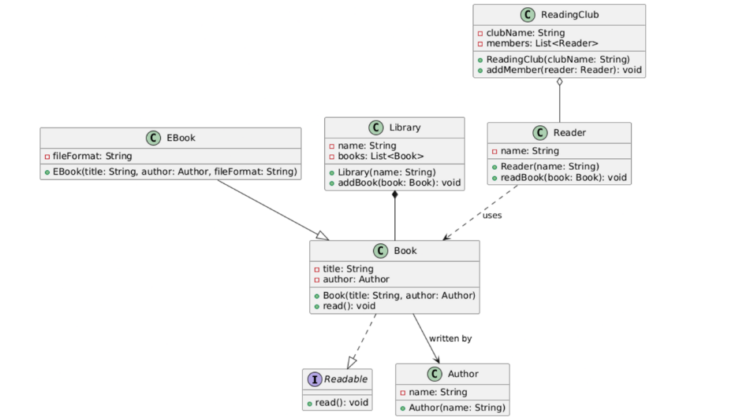

# **Basic Java OOPS**
Object-Oriented Programming (OOP) is a programming paradigm that organizes code into objects, which represent real-world entities. It allows developers to model complex systems by breaking them down into smaller, manageable pieces.

# **Table of Contents**
| sl. no. | topics |
|---------|--------------|
|   1.    | [Classes](#1-classes)      |
|   2.    | [Objects](#2-objects)      |
|   3     | [Constructors](#3-constructors)
|   4.    | [Polymorphism](#4-polymorphism) |
|   5.    | Encapsulation|
|   6.    | Inheritance  |
|   7.    | Java Key words|
|   8.    | Access Modifiers|
|   9.    | Exception Handling|
|   10.    | Generics and Wildcards|

# **1. Classes**
- A class is a blueprint for creating objects. 
- It defines the properties (attributes) and behaviors (methods) that the objects will have.

Key Characteristics of a Class:
1. **Attributes** `(State)`: These are `variables` defined within the class that describe the characteristics of the object. 
2. **Methods** `(Behavior)`: These are `functions` defined in the class that describe what the objects can do. 🔧
3. **Constructor**: A special method used to `initialize the attributes` of the class when an object is created. 🛠️

```java
public class Car {
    // Attributes : 
    String manufacturer;
    String model;
    int year;

    // Constructor : 
    public Car(String manufacturer, String model, int year) {
        this.manufacturer = manufacturer;
        this.model = model;
        this.year = year;
    }

    // Methods : 
    public void startEngine() {
        System.out.println("The " + year + " " + manufacturer + " " + model + "'s engine has started.");
    }
    public void displayInfo() {
        System.out.println("Car Info: " + manufacturer + " " + model + " (" + year + ")");
    }
}
```

# **2. Objects**
An object is an instance of a class. It represents a specific realization of the class blueprint, with its own unique set of data.

Key Characteristics of an Object:
1. **State**: Represented by the object’s `attributes`.
2. **Behavior**: Defined by the `methods` the object can execute.
3. **Identity**: A `unique reference` to the object in memory.

```java
public class Main {
    public static void main(String[] args) {

        // Creating objects
        Car car1 = new Car("Toyota", "Corolla", 2021);
        Car car2 = new Car("Honda", "Civic", 2022);

        // Using objects
        car1.startEngine();  // Output: The 2021 Toyota Corolla's engine has started.ĺ
        car2.startEngine();  // Output: The 2022 Honda Civic's engine has started.
        car1.displayInfo();  // Output: Car Info: Toyota Corolla (2021)
        car2.displayInfo();  // Output: Car Info: Honda Civic (2022)
    }
}
```

## **Class Relationships**
**1. Inheritance**:
- Inheritance represents an **`is-a`** relationship where a subclass inherits properties and behaviors from its parent class.

```java
// Parent class
class Animal {
  void eat() {
    System.out.println("Animal is eating.");
  }
}

// Subclass inheriting from Animal
class Dog extends Animal {
  void bark() {
    System.out.println("Dog barks: Woof Woof!");
  }
}

public class InheritanceDemo {
  public static void main(String[] args) {
    Dog dog = new Dog();
    dog.eat(); // Inherited behavior
    dog.bark(); // Specific behavior
  }
}
```

2. **Association**
- Association is a `general relationship` where one class knows about or uses another. 
- It's like a `friendship` — two entities are aware of each other, `but they exist independently`.

```java
// A Person can have a Car.
class Car {
  String model;
  Car(String model) {
    this.model = model;
  }
  void drive() {
    System.out.println("Driving a " + model);
  }
}

class Person {
  String name;
  // Association: A Person "has a" Car.
  Car car;
  Person(String name, Car car) {
    this.name = name;
    this.car = car;
  }
  void goForDrive() {
    System.out.println(name + " is going for a drive.");
    car.drive();
  }
}

public class AssociationDemo {
  public static void main(String[] args) {
    Car car = new Car("Tesla Model 3");
    Person person = new Person("Alice", car);
    person.goForDrive();
  }
}
```
- Person has a reference to Car, representing an association.
- Both Person and Car exist independently. The Car doesn't rely solely on the Person for its existence.

**3. Aggregation**
- Aggregation is a `specialized form of association` that represents a `has-a` relationship where the parts can exist independently of the whole — but they are grouped together by a container.
- Think of a Team and its Players: a team has players, yet the players can exist even if the team is disbanded.

```java
import java.util.ArrayList;
import java.util.List;

class Player {
  String name;
  Player(String name) {
    this.name = name;
  }
}

class Team {
  String teamName;
  // Aggregation: A team "has" players.
  List<Player> players = new ArrayList<>();
  Team(String teamName) {
    this.teamName = teamName;
  }
  void addPlayer(Player player) {
    players.add(player);
  }
  void showTeam() {
    System.out.println("Team " + teamName + " has players:");
    for (Player p : players) {
      System.out.println(" - " + p.name);
    }
  }
}

public class AggregationDemo {
  public static void main(String[] args) {
    Team team = new Team("Warriors");
    team.addPlayer(new Player("Stephen"));
    team.addPlayer(new Player("Klay"));
    team.showTeam();
  }
}
```

Explanation:
- Team aggregates Player objects.
- Players exist independently of the team—they can join or leave different teams.


**Key Differences Between Association and Aggregation**:

- **Association** is a `general relationship` (friendship) with `no ownership` implied; objects `simply interact` or `use each other`.

- **Aggregation** represents a `“has-a” relationship` where one object (the whole) contains or references other objects (the parts), but the `parts can exist independently of the whole`.


**4. Composition**:

- Composition is a `stronger form of aggregation` with `full ownership` — if the whole is destroyed, the `parts cannot exist independently`. 
- Think of a House and its Rooms: without the house, the rooms cease to exist.

```java
class Room {
  String name;
  Room(String name) {
    this.name = name;
  }
}

class House {
  // Composition: A House is composed of Rooms.
  private Room livingRoom;
  private Room kitchen;
  House() {
    // Rooms are created and owned by the House.
    livingRoom = new Room("Living Room");
    kitchen = new Room("Kitchen");
  }
  void showHouse() {
    System.out.println(
        "House contains: " + livingRoom.name + " and " + kitchen.name);
  }
}

public class CompositionDemo {
  public static void main(String[] args) {
    House house = new House();
    house.showHouse();
  }
}
```

Explanation:
- House creates and controls the lifecycle of Room objects.
- The Room objects do not exist outside the context of the House.
- The composition relationships indicate that a House is composed of Room objects, meaning the rooms are created and owned by the house and do not exist independently.

‍
**5. Dependency**
- Dependency represents a `temporary relationship` where `one class uses another class`, typically `via method parameters` or `local variables`. 

```java
class Printer {
  void print(String message) {
    System.out.println("Printing: " + message);
  }
}

class Document {
  String content;
  Document(String content) {
    this.content = content;
  }
  // Dependency: Document uses Printer to print its content.
  void printDocument(Printer printer) {
    printer.print(content);
  }
}

public class DependencyDemo {
  public static void main(String[] args) {
    Document doc = new Document("Hello, World!");
    Printer printer = new Printer();
    doc.printDocument(printer);
  }
}
```

Explanation:
- Document doesn’t store a Printer; it simply uses one when needed.
- The relationship is transient and exists only during the method call.

‍
**Key Differences Between Association and Dependency:**

1. `Association`:
- `Objects` are `passed (often via constructors or setters)` and stored as `persistent fields`. 
- This creates a `long-term relationship` where the object is available throughout the lifetime of the class. 

For example, a Person stores a reference to a Car and uses it whenever needed.

2. `Dependency`:
- `Objects` are `passed as method parameters` and used `only within that method's scope`. 
- This creates a `short-term, temporary relationship` where the object is used just for the duration of the method call, and isn't stored for later use. 

For example, a Document receives a Printer to print its content and doesn't keep a reference to the Printer afterward.

‍
**6. Interfaces**
- Realization represents a relationship where a class implements an interface. 
- It’s like signing a contract to provide specific behaviors.

```java
interface Payment {
  void pay();
}

class CreditCardPayment implements Payment {
  @Override
  public void pay() {
    System.out.println("Paid using Credit Card.");
  }
}
// similarly cash and UPI can also have their own implementation
class CashPayment implements Payment {
  @Override
  public void pay() {
    System.out.println("Paid using Cash.");
  }
}

public class RealizationDemo {
  public static void main(String[] args) {
    Payment payment1 = new CreditCardPayment(); // parent -> child possible bcoz parent is an interface
    Payment payment2 = new CashPayment();
    payment1.pay();
    payment2.pay();
  }
}

```
Explanation:
- Payment is an interface that declares the pay() method.
- CreditCardPayment and CashPayment implement this interface, providing their own versions of pay().

‍
## **Simple example of a Library Management System**



1. `Book and EBook`:
- Book has attributes for title and an associated Author. EBook **extends** Book by adding a fileFormat attribute. 
- The **inheritance** arrow (`solid line with a closed arrowhead`) shows that EBook is a specialized type of Book.


2. `Association (Book & Author)`:
- The *`arrow`* from Book to Author indicates that every book is written by an author. 
- This is a **simple association** where both objects can exist independently.


3. `Composition (Library & Book)`:
- The *`filled diamond`* from Library to Book indicates **composition**. 
- A library is composed of books, meaning the library strongly owns its books.


4. `Dependency (Reader & Book)`:
- The *`dashed arrow`* from Reader to Book denotes a **dependency**. 
- A reader uses a book (for example, to read), but does not own it.


5. `Aggregation (ReadingClub & Reader)`:
- The *`open diamond`* from ReadingClub to Reader represents **aggregation**. 
- A reading club groups readers together, but readers can exist independently of the club.

‍
# 3. **Constructors**:
- Constructors are special methods in object-oriented programming used to `initialize objects of a class`.
- Unlike regular methods, constructors have the `same name as the class` and `do not have a return type`. 🔧

Key Features of Constructors:
1. `Automatic Invocation`: Constructors are called automatically when an object of the class is instantiated. 

2. `No Return Type`: Unlike methods, constructors do not have a return type, not even void. 

3. `Overloading Support`: You can have multiple constructors with different parameters in the same class, enabling flexibility in object initialization. 

### **Types of Constructors**:
Constructors can be broadly categorized into the following types:

1. [**Default Constructor**](#1-default-constructor-no-argument-constructor)
2. [**Parameterised Constructor**](#2-parameterized-constructor)
3. [**Copy Constructor**](#3-copy-constructor)
4. [**Private Constructor**](#4-private-constructor)

‍
#### **1. Default Constructor (No-Argument Constructor)**:
**1.1 Implicit Default Constructor**: When No Constructor is defined
- If you do not explicitly create any constructor for a class, Java automatically provides a default constructor.
- This constructor initializes instance variables to their default values based on the data type.

```
Default Values:
int → 0
double → 0.0
boolean → false
Object → null
```
```java
class Movie {
  private String title; // Default: null
  private int duration; // Default: 0

  public void displayDetails() {
    System.out.println("Title: " + title + ", Duration: " + duration + " mins");
  }
}

public class Main {
  public static void main(String[] args) {
    Movie movie = new Movie(); // Implicit default constructor is called
    movie.displayDetails(); // Displays default values
  }
}
```
‍
Output : 

```
Title: null, Duration: 0 mins
```
‍
**1.2 Explicitly Default Constructor**: 
- You can define your own default constructor to set custom default values for the class fields instead of relying on Java's implicit default values.

Example : ‍

```java
class Movie {
  private String title;
  private int duration;

  // Custom default constructor
  public Movie() {
    this.title = "Untitled";
    this.duration = 90;
  }
  public void displayDetails() {
    System.out.println("Title: " + title + ", Duration: " + duration + " mins");
  }
}

public class Main {
  public static void main(String[] args) {
    Movie movie = new Movie(); // Custom default constructor is called
    movie.displayDetails(); // Displays custom default values
  }
}
```
Output : 
```
Title: Untitled, Duration: 90 mins
```

### **2. Parameterized Constructor:**
A parameterized constructor takes arguments to initialize the object with specific values.

Example : 

```java
class Movie {
  private String title;
  private int duration;

  // Parameterized constructor
  public Movie(String title, int duration) {
    this.title = title;
    this.duration = duration;
  }
  public void displayDetails() {
    System.out.println("Title: " + title + ", Duration: " + duration + " mins");
  }
}

public class Main {
  public static void main(String[] args) {
    Movie movie =
        new Movie("Inception", 148); // Parameterized constructor is called
    movie.displayDetails();
  }
}
```
Output : 
```
Title: Inception, Duration: 148 mins
```

### **3. Copy Constructor:**
A copy constructor initializes an object using another object of the same class.

Example : 

```java
class Movie {
  private String title;
  private int duration;

  // Parameterized constructor
  public Movie(String title, int duration) {
    this.title = title;
    this.duration = duration;
  }

  // Copy constructor
  public Movie(Movie other) {
    this.title = other.title;
    this.duration = other.duration;
  }
  public void displayDetails() {
    System.out.println("Title: " + title + ", Duration: " + duration + " mins");
  }
}

public class Main {
  public static void main(String[] args) {
    Movie original = new Movie("Inception", 148);
    Movie copy = new Movie(original); // Copy constructor is called
    copy.displayDetails();
  }
}
```

Output : 
```
Title: Inception, Duration: 148 mins
```

‍

### **4. Private Constructor:**
- A private constructor is used to restrict object creation from outside the class. 
- It is commonly used in Singleton Design Pattern.

Example : 
```java
class Singleton {
  private static Singleton instance;
  // Private constructor
  private Singleton() {}
  public static Singleton getInstance() {
    if (instance == null) {
      instance = new Singleton();
    }
    return instance;
  }
}

public class Main {
  public static void main(String[] args) {
    Singleton s1 = Singleton.getInstance();
    Singleton s2 = Singleton.getInstance();
    System.out.println(s1
        == s2); // Output: true, as both references point to the same instance
  }
}
```

**Key Points to Remember:**

1. A class can have multiple constructors through overloading, but they must differ in parameter lists.
2. Constructors can call `other constructors in the same class` using `this()`.
3. Constructors can call `parent class constructors` using `super()` in java.‍
4. Utilize `copy constructors` carefully to avoid shallow copying when `deep copying` is required.

‍
#### Interview Questions : 
*1. Can a constructor be final, static, or abstract? Why or why not?*

Answer: No, constructors `cannot` be final, static, or abstract because:
- `final`: A `constructor cannot be inherited`, so final is irrelevant.
- `static`: `Constructors belong to objects`, not the class itself.
- `abstract`: A `constructor must be concrete` as it initializes an object.

*2. What happens if you explicitly define a constructor with arguments but no default constructor?*

Answer: The default constructor is not automatically provided. Attempting to create an object with no arguments will result in a compilation error.

```java
class Example {
  public Example(int a, int b) {
    this.a = a;
    this.b = b;
  }

  public static void main(String[] args) {
    Example example = new Example();
    System.out.println(example);
  }
}

// Output :
// Compilation Error
```

*3. What happens if you create an object of a subclass? Which constructor is called first?*

Answer: The parent class constructor is called first, followed by the subclass constructor. This ensures proper initialization.


*4. What happens if a constructor is synchronized?*

Answer: A synchronized constructor is allowed but makes no sense, as object-level synchronization is not applicable before the object is fully created.

*5. Can a constructor be inherited?*

Answer: `No, constructors are not inherited`, but a subclass can call the superclass constructor using super().

*6. Can a constructor have a return statement?*

Answer: No, constructors cannot return a value, but they can have a return statement to exit early (without a value).
```java
class Example {
  private int value;
  // Constructor with a return statement
  public Example(int value) {
    if (value < 0) {
      System.out.println("Invalid value! Constructor exiting early.");
      return; // Exits the constructor early
    }
    this.value = value; // Initializes the value if valid
  }
  public void display() {
    System.out.println("Value: " + value);
  }
}

public class Main {
  public static void main(String[] args) {
    Example obj1 = new Example(10); // Valid value
    obj1.display();
    Example obj2 = new Example(-5); // Invalid value, constructor exits early
    obj2.display();
  }
}

// Output : 
// Value: 10
// Invalid value! Constructor exiting early.
// Value: 0
```

# **4. Polymorphism**
- Polymorphism enables objects to take on multiple forms. 
- It allows the same operation to behave differently on different classes, enhancing code flexibility and reusability.

In Java, polymorphism can be broadly classified into two main types:

[**1. Compile-time (or Static) Polymorphism**](#1-compile-time-static-polymorphism)

[**2. Runtime (or Dynamic) Polymorphism**]()
‍
### **1. Compile-time (Static) Polymorphism:**
- Compile-time or Static polymorphism occurs when the `method to be executed is determined at compile time`. 
- It is achieved using `method overloading` or `operator overloading`.
- **Note:** Operator Overloading is not supported in Java
‍

#### **Method Overloading:**
- When there are multiple functions with the same name but different parameters, then the functions are said to be overloaded, hence this is known as Function or Method Overloading. 
- Functions can be **overloaded by changing** the `number of arguments` or/and changing the `type of arguments`.

Example : 
1. Changing the `number of arguments`: 
```java
class Vehicle {
  // Method to start a vehicle with basic information
  void start(String vehicleType) {
    System.out.println("Starting a " + vehicleType);
  }

  // Overloaded method to start a vehicle with extra information
  void start(String vehicleType, int speed) {
    System.out.println(
        "Starting a " + vehicleType + " with speed: " + speed + " km/h");
  }
}

public class Main {
  public static void main(String[] args) {
    Vehicle vehicle = new Vehicle();

    // Calls method with one argument
    vehicle.start("Car");

    // Calls overloaded method with two arguments
    vehicle.start("Bike", 60);
  }
}
```

2. Changing the `type of arguments` :

```java
class Vehicle {
  // Method to start a vehicle with a string parameter
  void start(String vehicleType) {
    System.out.println("Starting a " + vehicleType);
  }

  // Overloaded method to start a vehicle with an integer parameter
  void start(int vehicleId) {
    System.out.println("Starting a vehicle with ID: " + vehicleId);
  }
}

public class Main {
  public static void main(String[] args) {
    Vehicle vehicle = new Vehicle();

    // Calls method with a string argument
    vehicle.start("Truck");

    // Calls overloaded method with an integer argument
    vehicle.start(101);
  }
}
```

### **2. Runtime (Dynamic) Polymorphism:** 
- Runtime polymorphism occurs when the method to be executed is determined during runtime. 
- It is achieved through `method overriding` and is closely tied to inheritance.

#### **Method Overriding**: 
- Method overriding allows a subclass to provide a specific implementation for a method already defined in its parent class. 
- The overridden method in the subclass has the same name, return type, and parameters as the method in the parent class.

Example : 
```java
// Parent class
class Vehicle {
  void start() {
    System.out.println("Starting a generic vehicle");
  }
}

// Subclasses overriding the start method
class Car extends Vehicle {
  @Override
  void start() {
    System.out.println("Starting a car");
  }
}

class Bike extends Vehicle {
  @Override
  void start() {
    System.out.println("Starting a bike");
  }
}

class Truck extends Vehicle {
  @Override
  void start() {
    System.out.println("Starting a truck");
  }
}

public class Main {
  public static void main(String[] args) {
    Vehicle myVehicle;
    // Assign a Car object to the Vehicle reference
    myVehicle = new Car();
    myVehicle.start(); // Output: Starting a car

    // Assign a Bike object to the Vehicle reference
    myVehicle = new Bike();
    myVehicle.start(); // Output: Starting a bike

    // Assign a Truck object to the Vehicle reference
    myVehicle = new Truck();
    myVehicle.start(); // Output: Starting a truck
  }
}
```

- Advantage: reuse method names (code reuse)
- Disadvantage: complex debugging


# **7. Java Keywords**
### **1. this** keyword
- The "this" keyword provides a reference to the current object.
- It allows access to the object's properties, methods, and other members.

Use of "this":
1. `Disambiguation`: Resolves naming conflicts between instance variables and parameters or local variables.
2. `Chaining`: Enables method chaining or constructor chaining, improving code readability and structure. 
3. `Passing References`: Passes the current object as a parameter to other methods or functions. 
4. `Dynamic Binding`: Refers to the current object dynamically during runtime in polymorphic scenarios. 

‍
### **Differeny usecase scenarios of `this` keyword:**

1. `Referring to the Instance Object`:
- The "this" keyword is crucial when `differentiating between instance variables and method(setters) or constructor parameters` that share the `same name`. 
- In such cases, `it explicitly refers to the instance variable of the current object`, avoiding ambiguity. 

Example:
```java
class Person {
  private String name;

  // Constructor
  Person(String name) {
    this.name = name; // Resolves conflict between instance variable and parameter
  }
  void display() {
    System.out.println("Name: " + this.name);
  }
}

public class Main {
  public static void main(String[] args) {
    Person p = new Person("Alice");
    p.display();
  }
}
```

2. `Constructor Chaining`: 
- Using the "this" keyword for constructor chaining `allows one constructor to invoke another constructor within the same class`. 

Example:
```java
class Person {
  private String name;
  private int age;

  // Constructor 1
  Person(String name) {
    this(name, 0); // Calls Constructor 2
  }

  // Constructor 2
  Person(String name, int age) {
    this.name = name;
    this.age = age;
  }
  void display() {
    System.out.println("Name: " + name + ", Age: " + age);
  }
}

public class Main {
  public static void main(String[] args) {
    Person p = new Person("Alice");
    p.display();
  }
}
```

3. `Returning the Current Object`:
- The "this" keyword can be used to return the current instance of a class. 

Example:
```java
class Person {
  private String name;
  Person setName(String name) {
    this.name = name;
    return this; // Enables method chaining
  }
  void display() {
    System.out.println("Name: " + this.name);
  }
}

public class Main {
  public static void main(String[] args) {
    Person p = new Person();
    p.setName("Bob").display(); // method chaining using the returned object
  }
}
```

4. `Passing the Current Object`
- "this" can be used to pass the current object as a parameter to another method.

Example : 

```java
class Person {
  void greet(Person person) {
    System.out.println("Hello, " + person);
  }
  void introduce() {
    greet(this); // Passes the current object
  }
  @Override
  public String toString() {
    return "I am a Person instance.";
  }
}

public class Main {
  public static void main(String[] args) {
    Person p = new Person();
    p.introduce();
  }
}
```

## Note:
- **"this" cannot be used in static methods or contexts, which can be restrictive in certain situations.**

Example : 

```java
class Example {
  private String message = "Hello, World!";
  // Static method
  public static void displayMessage() {
    // Attempting to use 'this' in a static context will cause a compilation error
    System.out.println(this.message); 
    // ERROR: Cannot use 'this' in a static context
  }
  public void displayInstanceMessage() {
    System.out.println(this.message); // Valid: 'this' refers to the current instance
  }
}

public class Main {
  public static void main(String[] args) {
    // Calling static method
    Example.displayMessage(); // This would cause a compilation error
    // Creating an instance to call an instance method
    Example example = new Example();
    example.displayInstanceMessage(); // Works fine
  }
}
```
Explanation:
1. this refers to the current instance of the class.
2. Static methods do not belong to any specific instance; they are associated with the class itself.
3. `Since there is no instance in a static context, using "this" leads to a compilation error`.

‍

